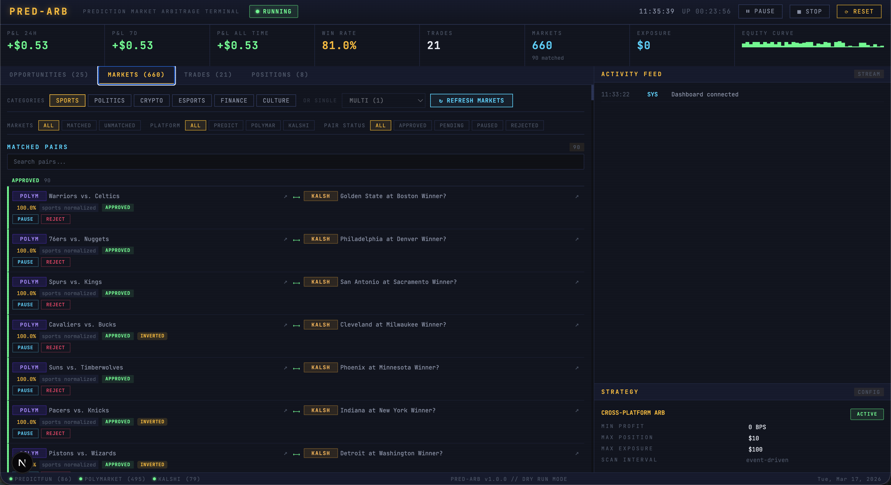
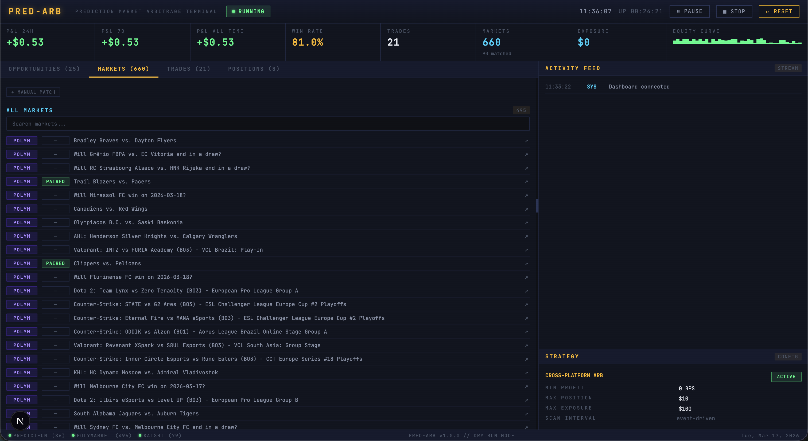
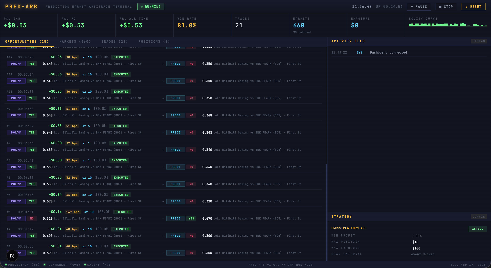
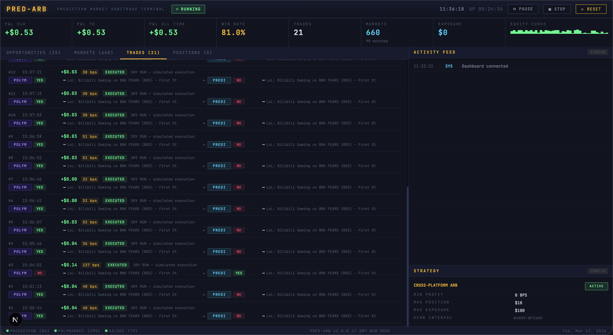
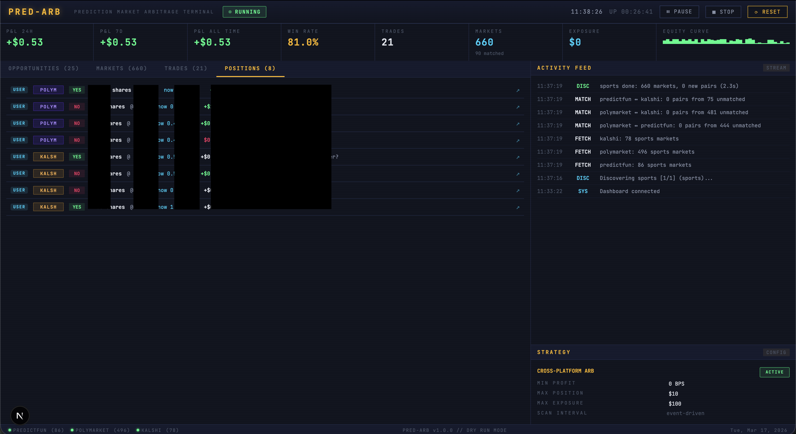
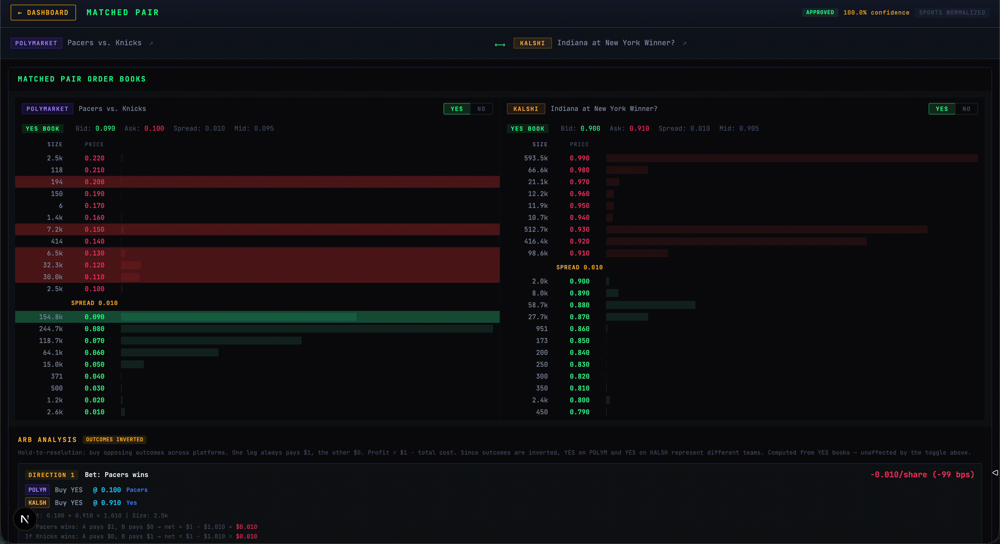

# pred-arb

Cross-platform prediction market arbitrage bot. Monitors [Polymarket](https://polymarket.com), [Kalshi](https://kalshi.com), and [predict.fun](https://predict.fun) for pricing discrepancies on equivalent markets, then executes simultaneous 2-legged trades to lock in risk-free profit.

Built with TypeScript, a real-time Next.js dashboard, and a category-aware matching engine that pairs identical markets across platforms — deterministically for sports, with LLM assistance for everything else.

## Screenshots

| | |
|---|---|
|  |  |
| Matched markets with status grouping | Manual market matching UI |
|  |  |
| Live arbitrage opportunities | Trade execution history |
|  | |
| Positions across all platforms | |
|  | |
| Monitor orderbooks | |

## How it works

Binary prediction markets settle at $1 (event happened) or $0 (it didn't). By buying YES on one platform and NO on another for the same event, the combined position pays out $1 regardless of the outcome. If both legs cost less than $1, the difference is guaranteed profit.

```
Polymarket:  "Will the Celtics beat the Lakers?" — YES @ $0.48
Kalshi:      "Will the Celtics beat the Lakers?" — NO  @ $0.49

Cost:   $0.48 + $0.49 = $0.97
Payout: $1.00 (guaranteed, regardless of who wins)
Profit: $0.03/share (≈ 3.1%)
```

The bot scans both directions (YES-A + NO-B and NO-A + YES-B) across all platform pairs, using WebSocket order book updates to detect opportunities in real time.

## Quick start

### Prerequisites

- **Node.js 18+** (20 LTS recommended)
- **Platform accounts** on at least 2 of: Polymarket, Kalshi, predict.fun
- **LLM** for non-sports market matching (optional — [Ollama](https://ollama.com) for free local inference, or an Anthropic API key)

### Install

```bash
git clone https://github.com/cjinghong/pred-arb.git
cd pred-arb
npm run setup        # installs backend + dashboard dependencies
cp .env.example .env
```

### Configure

Edit `.env` with your platform credentials. See `.env.example` for all options with descriptions.

The minimum you need to get started in dry-run mode (no real trades):

```env
# Pick your platforms (need at least 2)
ENABLED_PLATFORMS=polymarket,kalshi

# Polymarket — wallet keys for reading markets
POLYMARKET_PRIVATE_KEY=your_hex_private_key
POLYMARKET_PROXY_ADDRESS=0xYourProxyAddress

# Kalshi — API key + RSA private key for reading markets
KALSHI_API_KEY_ID=your_key_id
KALSHI_PRIVATE_KEY_PATH=./kalshi-key.pem

# Categories to scan
MARKET_CATEGORIES=sports,politics

# LLM for matching non-sports markets (optional)
LLM_PROVIDER=ollama
LLM_MODEL=llama3.1
```

> **No credentials?** The bot will still start and show the dashboard — connectors that fail to authenticate are skipped gracefully. You need at least 2 connected platforms for arbitrage detection.

### Run

```bash
# Development (hot-reload)
npm run dev                # bot + API on :3848
npm run dashboard:dev      # dashboard on :3847 (separate terminal)

# Production
npm run build:all          # compile everything
npm start                  # bot + API + dashboard on :3848
```

Open the dashboard at `http://localhost:3847` (dev) or `http://localhost:3848` (production).

## Architecture

```
Bot Orchestrator (bot.ts)
  ├── Connectors (3 platforms)
  │     ├── PolymarketConnector   ← CLOB SDK, EIP-712, USDC/Polygon
  │     ├── KalshiConnector       ← RSA-PSS auth, USD/cents
  │     └── PredictFunConnector   ← SDK + JWT, USDT/BNB
  │
  ├── Market Discovery (category-aware)
  │     ├── SportsDiscovery       ← platform-specific sports APIs
  │     └── Generic Discovery     ← paginated category fetching
  │
  ├── Market Matching
  │     ├── SportsMatcher         ← deterministic team+date matching (no LLM)
  │     ├── MarketMatcher         ← 5-pass pipeline: cross-ref → slug → fuzzy → LLM
  │     └── LLMVerifier           ← Anthropic / Ollama / OpenAI-compatible
  │
  ├── Strategy: CrossPlatformArb
  │     ├── Book walking          ← walks multiple price levels for optimal sizing
  │     ├── Fee-aware analysis    ← platform-specific fee deduction
  │     └── Dynamic thresholds    ← adjusts min profit by confidence/spread/depth
  │
  ├── ExecutionEngine             ← 2-legged simultaneous trades
  ├── RiskManager                 ← position limits, exposure caps, balance checks
  │
  └── API Server (Express + WebSocket)
        └── Dashboard (Next.js)   ← Bloomberg terminal-style UI
```

### N-platform pairwise design

With 3 platforms, the bot generates all unique pairs and runs matching independently on each:

- Polymarket ↔ Kalshi
- Polymarket ↔ predict.fun
- predict.fun ↔ Kalshi

Connector failures are non-fatal — the bot continues with whichever platforms connect successfully (minimum 2 required).

### Category-aware market discovery

Market discovery and matching are routed through category-specific pipelines. Set `MARKET_CATEGORIES=sports,politics,crypto` to process each category sequentially — fetch from all platforms, match within the category, then move to the next. This avoids cross-category noise and wasted LLM calls.

**Sports** use a fully deterministic pipeline: platform-specific sports APIs → team name normalization (100+ alias entries across NBA, NFL, NHL, MLB, MLS, UFC) → match by `team1|team2::date::league` key. No LLM needed — matches are instant and accurate.

**Non-sports** (politics, crypto, etc.) use a generic 5-pass pipeline with increasing fuzziness: cross-reference IDs → slug matching → fuzzy text grouping (Fuse.js) → LLM verification (Anthropic tool_use for guaranteed JSON). LLM-matched pairs below 0.95 confidence require manual approval on the dashboard.

### Outcome alignment

A critical challenge in cross-platform arbitrage is that platforms may define outcomes differently. Kalshi creates separate per-team markets (one for each team), while Polymarket and predict.fun use a single binary market. The bot detects and handles this automatically through multi-layer inversion detection — comparing team names, outcome labels, question similarity, and slug/ticker patterns to ensure the hedge is correct and you're never accidentally doubling down on the same outcome.

## Dashboard

The dashboard uses a retro Bloomberg terminal aesthetic — amber/green on black, monospace font, scanline overlay.

**Tabs:**

- **Opportunities** — live arb opportunities with profit, prices, status, and match confidence
- **Markets** — all fetched markets, matched pairs grouped by status (approved/pending/paused/rejected), manual match UI, and category filtering
- **Trades** — execution history with per-leg details, platform labels, and P&L
- **Positions** — live positions across all platforms with links to each platform's market page

**Header controls:** PAUSE / RESUME / STOP / RESET (full database wipe with confirmation)

**Activity feed:** real-time stream of discovery progress, matching results (per-pass breakdown), scan completions, and trade events.

**Pair detail page:** click any matched pair to see side-by-side live order books with YES/NO toggle, arb analysis showing both trade directions, and scenario breakdowns.

## Project structure

```
pred-arb/
├── src/
│   ├── connectors/           # Platform connectors (Polymarket, Kalshi, predict.fun)
│   ├── discovery/            # Category-aware market discovery
│   ├── matcher/              # Market matching (sports, generic, LLM)
│   ├── strategies/           # Arbitrage strategy
│   ├── engine/               # Bot orchestrator, execution, risk, API server
│   ├── db/                   # SQLite database
│   ├── utils/                # Config, logging, event bus, rate limiter, diagnostics
│   ├── scripts/              # Standalone test scripts per platform + LLM
│   └── index.ts              # Entry point
├── dashboard/                # Next.js frontend (static export)
├── docs/                     # Strategy documentation
├── data/                     # SQLite DB + diagnostic logs (gitignored)
├── .env.example              # Environment template with full docs
├── package.json
└── tsconfig.json
```

## Configuration reference

All configuration is via environment variables. See `.env.example` for the complete list with descriptions.

**Key settings:**

| Variable | Default | Description |
|---|---|---|
| `ENABLED_PLATFORMS` | `polymarket,kalshi` | Comma-separated platforms to connect |
| `DRY_RUN` | `true` | Set to `false` for live trading |
| `MIN_PROFIT_BPS` | `150` | Minimum profit threshold in basis points |
| `MAX_POSITION_USD` | `500` | Max USD per trade leg |
| `MAX_TOTAL_EXPOSURE_USD` | `5000` | Total portfolio exposure cap |
| `MARKET_CATEGORIES` | — | Categories to scan (e.g., `sports,politics`) |
| `LLM_PROVIDER` | `anthropic` | LLM for generic matching: `ollama`, `anthropic`, `openai` |
| `LLM_MODEL` | `claude-sonnet-4-20250514` | Model name (provider-specific) |
| `SCAN_INTERVAL_MS` | `10000` | Milliseconds between opportunity scans |
| `PAIR_REFRESH_INTERVAL_MS` | `300000` | Milliseconds between market re-matching |

## Live trading

> **⚠️ The bot starts in dry-run mode by default.** No real orders are placed unless you explicitly set `DRY_RUN=false`. Review simulated results thoroughly before going live.

**Recommended go-live sequence:**

1. Run in dry-run mode, review matched pairs and simulated opportunities on the dashboard
2. Check the diagnostic logs in `data/arb-diagnostics-*.txt` to verify hedge correctness
3. Set conservative limits: `MAX_POSITION_USD=10`, `MIN_PROFIT_BPS=200`
4. Set `DRY_RUN=false`, monitor for 24h
5. Gradually increase position sizes as confidence grows

**Platform requirements for live trading:**

- **Polymarket** — funded USDC wallet on Polygon, proxy wallet address, L2 API credentials (key/secret/passphrase) or private key for auto-derivation
- **Kalshi** — API key ID + RSA-4096 private key (inline PEM or file path)
- **predict.fun** — API key, Privy wallet private key, Smart Wallet address on BNB chain

**Fee schedule:**

| Platform | Maker | Taker |
|---|---|---|
| Polymarket | 0% | 0% |
| Kalshi | 0% | $0.07 × P × (1−P) per contract (min $0.02) |
| predict.fun | 0% | 2% × min(price, 1−price) × shares |

All fees are automatically deducted from profit calculations before an opportunity is surfaced.

## Adding a new platform

1. Implement the `MarketConnector` interface in `src/connectors/`:

```typescript
export class MyPlatformConnector extends BaseConnector {
  readonly platform: Platform = 'myplatform';
  readonly name = 'My Platform';

  async connect(): Promise<void> { /* auth, WebSocket setup */ }
  async fetchMarkets(opts?: FetchMarketsOptions): Promise<NormalizedMarket[]> { /* ... */ }
  async fetchOrderBook(marketId: string, outcomeIndex: number): Promise<OrderBook> { /* ... */ }
  async placeOrder(order: OrderRequest): Promise<OrderResult> { /* ... */ }
  async cancelOrder(orderId: string): Promise<boolean> { /* ... */ }
  async getOpenOrders(): Promise<OrderResult[]> { /* ... */ }
  async getOrder(orderId: string): Promise<OrderResult | null> { /* ... */ }
  async getBalance(): Promise<number> { /* ... */ }
}
```

2. Add `'myplatform'` to the `Platform` type in `src/types/market.ts`
3. Register the connector in `src/engine/bot.ts`
4. Add rate limit config in `src/utils/rate-limiter.ts`
5. Add fee calculation in `src/strategies/cross-platform-arb.ts` → `estimateFees()`

The bot will automatically include the new platform in all pairwise matching combinations.

## Development

```bash
npm run dev              # hot-reload backend
npm run dashboard:dev    # hot-reload frontend (separate terminal)
npm run typecheck        # TypeScript check (no emit)
npm test                 # run tests
npm run build:all        # compile everything
```

**Standalone test scripts** for each platform connector:

```bash
npx ts-node src/scripts/test-polymarket.ts balance    # check Polymarket balance
npx ts-node src/scripts/test-kalshi.ts markets         # fetch Kalshi markets
npx ts-node src/scripts/test-predictfun.ts full-test   # full predict.fun test suite
npx ts-node src/scripts/test-llm.ts bucket             # test LLM matching pipeline
```

## Tech stack

| Layer | Technology |
|---|---|
| Runtime | TypeScript, Node.js 18+ |
| Platforms | Polymarket (CLOB SDK), Kalshi (REST + RSA-PSS), predict.fun (SDK + JWT) |
| Matching | Deterministic (sports) + Fuse.js + LLM (Anthropic tool_use / Ollama) |
| Database | SQLite (better-sqlite3) |
| API | Express + WebSocket |
| Dashboard | Next.js 15 (React, static export) |
| Signing | ethers.js v6 (EIP-712, typed data) |

## Disclaimer

This software is provided as-is for educational and research purposes. Trading on prediction markets involves real financial risk. The authors are not responsible for any losses incurred from using this software. Always start with small amounts and understand the risks before enabling live trading.

## License

MIT
